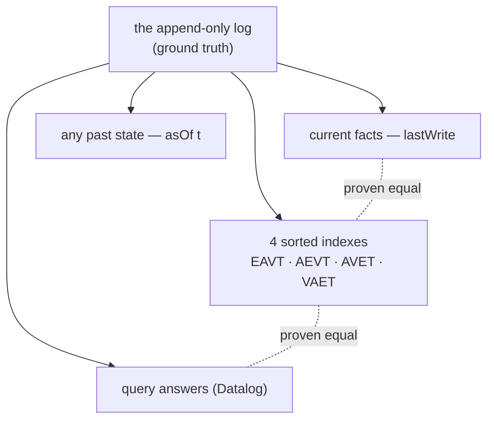

# DatomBau

**A database that remembers everything — with proofs.**

DatomBau is a verified core of [Datomic](https://www.datomic.com/)'s
architecture, built in Lean 4. An ordinary database stores a system's
*current state* and destroys the past on every update — like knowing a
particle's position with no record of its trajectory. DatomBau stores the
**trajectory**: an append-only log of timestamped events. The current
state, the state at any earlier time, the indexes, and every query answer
are *pure functions of the log* — and because the whole thing lives
inside a proof assistant, each of those claims is a machine-checked
theorem rather than a promise.



## Start here

| you want… | go to… |
|---|---|
| to *play* — sliders, animations, a button that provably can't change the past | **[the interactive tour](https://tobiasosborne.github.io/DatomBau/tour.html)** |
| a guided walkthrough with runnable code (no Lean experience assumed) | **[TUTORIAL.md](TUTORIAL.md)** |
| to see it run | `./run.sh` — builds and runs the end-to-end demo |
| the theorems | the table below, then the files in `DatomBau/` |

## The headline theorem

```lean
theorem Db.query_asOf_stable_data
    (h : db.transactData forms now = .ok r) (ht : t ≤ db.maxTx) (q : Query) :
    (r.db.asOf t).query q = (db.asOf t).query q
```

*A query against a past basis is frozen for all time* — no future
transaction can change its answer. The proof is a one-line `rw`, and that
is the point: the design (value-equality `asOf` theorems, spec-first
evaluation, the index bridge) was chosen to make "the database is a
value" literally a rewrite.

## What we prove

| Theorem | File | In words |
|---|---|---|
| `Db.asOf_append` | `Spec.lean` | Appending a fresh transaction changes no `asOf` view — as value equality, with no well-formedness hypotheses |
| `Db.asOf_maxTx` | `Spec.lean` | The view at the current basis *is* the database |
| `Db.transact_wf` | `Transactor.lean` | The transactor preserves well-formedness: monotone tx ids and instants, bounded entity ids (including refs), every appended datom well-typed, every tx carries its `:db/txInstant` |
| `Db.transactAt_cardOne` | `Transactor.lean` | Cardinality-one attributes keep at most one current value per entity |
| `Db.transactAt_unique` | `Transactor.lean` | A unique `(attribute, value)` identifies at most one entity |
| `Db.transactData_invariants` | `Transactor.lean` | All of the above, bundled for the full transactor (tempids + upsert) |
| `IndexedDb.ofDb_wf` | `Index.lean` | Index coherence: an entry is in EAVT/AEVT/AVET/VAET iff the log's last write of its fact was an assertion in exactly that transaction |
| `IndexedDb.mem_datoms*` | `Index.lean` | The `d/datoms` lookups return exactly the spec's answers, in index order |
| `Db.evalSpec_sound` | `Query.lean` | Every query result matches every clause and binds exactly the query's variables |
| `Db.evalSpec_complete` | `Query.lean` | Every matching binding is found (up to agreement on the query's variables) |
| `IndexedDb.evalIdx_mem_iff` | `Query.lean` | The bridge: index-backed evaluation answers exactly what the spec answers |
| `Db.query_asOf_stable*` | `Query.lean` | The headline, in three flavors: plain ops, full transactor, index engine |

There is no `sorry` on master: if `lake build` succeeds, every theorem
above is true. The `#guard` blocks in each module are compile-time unit
tests for the executable side.

## Architecture

```
Core.lean        Keyword, Value, Fact, TxDatom, Datom, Entry;
                 all comparators as compareLex/compareOn chains with
                 TransCmp + LawfulEqCmp instances (no derived Ord)
Schema.lean      value types, cardinality, uniqueness; schema fixed at
                 db creation (schema-as-datoms bootstrap: future work)
Spec.lean        THE SEMANTIC MODEL: Transaction, Log, Db = {log, schema};
                 lastWrite as the membership function; asOf/since by
                 filter; Db.WF; the freeze theorems
Transactor.lean  expand (implicit card-one retraction, retractEntity),
                 elide no-ops, reject conflicts, validate, append;
                 tempids, unique-identity upsert; invariant proofs
Index.lean       EAVT/AEVT/AVET/VAET as Std.TreeSets of (fact, tx);
                 coherence + lookup correctness (d/datoms)
Pull.lean        entity-centric reads, forward and reverse (:ns/_attr)
Query.lean       Datalog: patterns, conjunction, find-projection;
                 soundness, completeness, the bridge, the headline
Main.lean        end-to-end demo (tempids, upsert, retractEntity,
                 time travel, tx-as-entity)
TUTORIAL.md      the guided walkthrough — start there
```

Zero dependencies beyond Lean core's `Std`; toolchain pinned in
`lean-toolchain`. If you don't have Lean:
`curl https://elan.lean-lang.org/elan-init.sh -sSf | sh`, then `./run.sh`.

## Design notes (deliberate choices)

- **The spec's fact "collection" is a function.** `Db.lastWrite f`
  returns the tx and added-flag of the last log write of `f`; membership
  is "last write was an assertion". Makes the membership characterization
  definitional and assert-idempotency free.
- **No cached counters.** `maxTx`/`nextId` are derived from the log —
  caching them would break the *value-equality* form of the freeze
  theorems.
- **No-op elision before conflict checks.** Re-asserts of current facts
  and retracts of absent facts are dropped, so "last write in the log"
  coincides with "asserting transaction" (which the index coherence
  statement relies on). Post-elision, add/retract polarity conflicts are
  provably impossible; the check remains as belt-and-braces.
- **Transactions are entities** from day 1: tx ids come from the same
  fresh-id stream, and every transaction carries its own
  `(tx, :db/txInstant, instant)` datom — queryable like any fact.
- **Bindings are assoc lists, not functions** — completeness would be
  *false as usually stated* with function bindings (infinitely many
  satisfying bindings differing on junk variables).
- **Entity/tx ids are plain `Nat`, not abbrevs**: `omega`'s frontend
  matches hypothesis types syntactically against `Nat`/`Int`/`Fin`, so
  abbrev-typed arithmetic facts are invisible to it.
- **Tempid resolution is single-pass**; tempid merges (one tempid
  upserting to two entities) are rejected — a documented strict subset of
  Datomic's fixpoint semantics.

## Future work

Rules/recursion (semi-naive evaluation), a history index, schema
alteration and the schema-as-datoms bootstrap, log serialization, an EDN
reader + REPL, incremental index maintenance (behind the same `WF`
contract), per-clause index selection (behind the same bridge theorem),
slice-based prefix scans, comparison predicates in queries. Out of scope:
excision, partitions, the peer/caching model.

## License

[AGPL-3.0](LICENSE).
