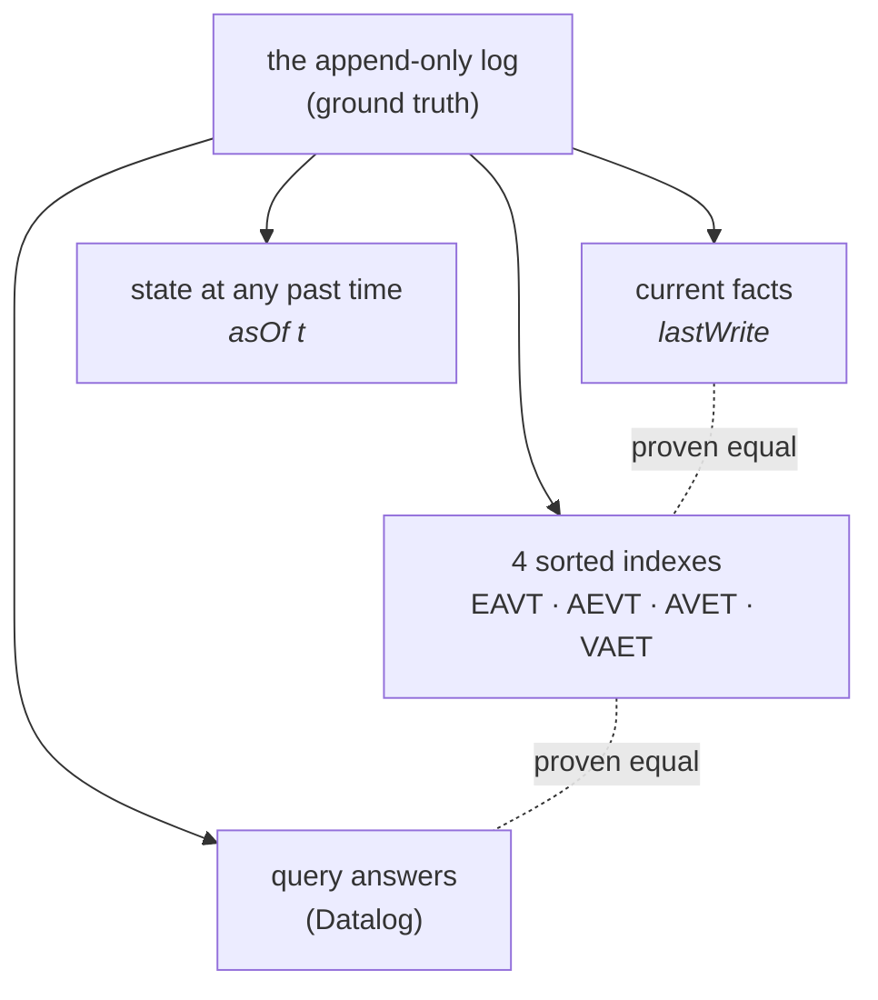
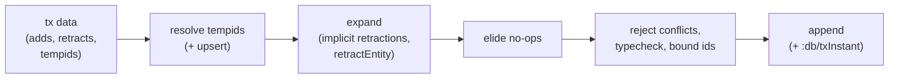

# A physicist's tutorial to DatomBau

*You know what a worldline is. You know what it means for the past to be
fixed. You have, at some point, been burned by a mutable global variable.
That is all the background this tutorial assumes.*

An interactive companion with animations of everything below lives here:
**[DatomBau — Interactive Tour](https://claude.ai/code/artifact/dbe4be21-9ecd-447b-92bb-b439b0a4b73b)**
(time-travel slider, index re-sorting, a query stepper, and a button that
tries — and provably fails — to change the past).

---

## 0. The idea in one paragraph

An ordinary database stores the **state** of a system and destroys it on
every update — like knowing a particle's position now with no record of
its trajectory. DatomBau (a reimplementation of the architecture of
[Datomic](https://www.datomic.com/)) stores the **trajectory**: an
append-only log of timestamped events. "The current state", "the state
last Tuesday", the indexes that make lookups fast, and the answers to
queries are all *derived views* — pure functions of the log. Because
DatomBau is written in the Lean 4 theorem prover, "derived view" is not a
design slogan; each one comes with a machine-checked theorem saying it
agrees with the log.



## 1. Setup (5 minutes)

You need `elan`, the Lean toolchain manager (like `rustup` for Lean):

```sh
curl https://elan.lean-lang.org/elan-init.sh -sSf | sh   # if you don't have it
cd DatomBau
./run.sh          # builds everything and runs the end-to-end demo
```

The first build downloads the pinned toolchain and takes a few minutes;
after that it's seconds. If `./run.sh` ends with a little story about Ada
and Grace, you're ready.

To *experiment*, create a file `Scratch.lean` in the repository root and
run it with:

```sh
lake env lean Scratch.lean
```

Anything you write in `#eval` gets printed; anything in `#guard` is an
assertion checked at compile time. All snippets below go in that file,
starting from:

```lean
import DatomBau
open DatomBau
```

## 2. The event: a datom

The atomic unit is a *datom* — one timestamped, signed statement:

```
   [ #1        :person/name       "Ada"        @tx4       + ]
     entity    attribute          value        when       asserted(+)
                                                          or retracted(−)
```

- **entity** — a bare number. Like a particle label, it has no internal
  structure; its meaning *is* the set of facts attached to it.
- **attribute** — a namespaced keyword naming the observable.
- **value** — a typed payload: string, integer, boolean, keyword,
  timestamp, or a *reference to another entity* (`.ref`), which is what
  makes the data a graph.
- **transaction** — which write event this statement belongs to.
- **±** — asserted or retracted. Nothing is ever deleted. To change
  Ada's name you append a retraction of the old fact and an assertion of
  the new one.

In Lean (`DatomBau/Core.lean`):

```lean
structure Fact where
  e : Nat        -- entity
  a : Keyword    -- attribute
  v : Value      -- value

structure Datom extends Fact where
  tx    : Nat    -- transaction
  added : Bool   -- + or −
```

## 3. The log is truth

A database *value* is just a list of transactions plus a schema
(`DatomBau/Spec.lean`):

```lean
structure Transaction where
  id      : Nat            -- the transaction's entity id
  instant : Nat            -- wall-clock milliseconds
  datoms  : List TxDatom

structure Db where
  log    : List Transaction
  schema : Schema
```

And here is the single most important definition in the project — the
answer to "is fact *f* true?":

> **Find the last datom about *f* in the log. The fact holds iff that
> datom was an assertion.**

```lean
def Db.lastWrite (db : Db) (f : Fact) : Option (Nat × Bool)   -- (tx, added?)
def Db.contains  (db : Db) (f : Fact) : Bool                  -- last write asserted?
```

That's it. No mutable cells anywhere. "The current state" is a *function
of history*, the way every observable in a deterministic theory is a
function of the trajectory.

Time travel is now almost embarrassing:

```lean
def Db.asOf (db : Db) (t : Nat) : Db :=
  { db with log := db.log.filter (fun tr => tr.id ≤ t) }
```

The state as of time *t* is the log with the future filtered off. Try it
(this uses the tutorial schema we'll build in §4 — paste §4 first):

```lean
#eval db₂.contains ⟨1, kName, .str "Ada Lovelace"⟩          -- true
#eval db₂.contains ⟨1, kName, .str "Ada"⟩                   -- false: renamed
#eval (db₂.asOf 3).contains ⟨1, kName, .str "Ada"⟩          -- true: the past
```

### The freeze theorem

Because `asOf` filters and `append` appends, the past is *rigid*, and this
is a theorem, not a habit:

```lean
theorem Db.asOf_append (hfresh : db.maxTx < t.id) (htx : tx ≤ db.maxTx) :
    (db.append t).asOf tx = db.asOf tx
```

How to read a Lean theorem, in thirty seconds: everything before the `:`
is hypotheses (here: the appended transaction is genuinely new, and we're
looking at a basis that already existed); after the `:` is the claim —
and note it is **equality of database values**, not merely "they answer
queries the same way". The proof is checked by Lean's kernel; if it were
wrong, the project would not compile.

## 4. Writing: the transactor

You never build transactions by hand. You submit *transaction data* and
the transactor turns it into one appended, validated transaction:



Paste this into `Scratch.lean` — it's the working core of the demo:

```lean
import DatomBau
open DatomBau

def kName   : Keyword := .ofString ":person/name"
def kEmail  : Keyword := .ofString ":person/email"
def kFriend : Keyword := .ofString ":person/friend"

def schema : Schema := .ofList
  [(kName,   { valueType := .str }),
   (kEmail,  { valueType := .str, unique := .identity }),
   (kFriend, { valueType := .ref, cardinality := .many })]

-- Transaction 1: create two people. "ada"/"grace" are *tempids* —
-- placeholder names; the transactor allocates real entity ids.
def r₁ : TxReport :=
  match (Db.empty schema).transactData
    [.add (.tmp "ada")   kName   (.val (.str "Ada")),
     .add (.tmp "ada")   kEmail  (.val (.str "ada@lovelace.io")),
     .add (.tmp "grace") kName   (.val (.str "Grace")),
     .add (.tmp "grace") kFriend (.tmp "ada")] 1000 with
  | .ok r => r
  | .error _ => ⟨Db.empty schema, 0, []⟩

#eval r₁.tempids     -- [("ada", 1), ("grace", 2)]  — allocated ids
#eval r₁.txId        -- 3 — the transaction is an entity too!

-- Transaction 2: rename Ada. :person/name is cardinality-one, so the
-- transactor *implicitly retracts* the old name. No delete was written.
def db₂ : Db :=
  match r₁.db.transactData
    [.add (.id 1) kName (.val (.str "Ada Lovelace"))] 2000 with
  | .ok r => r.db
  | .error _ => r₁.db
```

Things worth poking at:

- **Upsert.** `:person/email` is declared `unique := .identity`. Transact
  a *new* tempid asserting an email that already exists, and the tempid
  resolves to the existing entity instead of creating a duplicate.
- **Refusals.** The transactor returns `.error` rather than corrupt the
  database. Try each of these and `#eval` the result:
  a wrong type (`.add (.id 1) kName (.val (.int 3))`), an undeclared
  attribute, two different names for one entity in one transaction, or a
  second entity claiming Ada's email.
- **`retractEntity`.** `[.retractEntity (.id 1)]` retracts every current
  fact about entity 1 *and every reference pointing at it*.

Each refusal corresponds to an invariant with a proof
(`DatomBau/Transactor.lean`): well-formedness is preserved
(`transact_wf`), a cardinality-one attribute never holds two values
(`transactAt_cardOne`), a unique value identifies at most one entity
(`transactAt_unique`).

## 5. Indexes: choosing coordinates

Scanning the whole log to answer every question is correct but slow, so
the same set of current facts is kept sorted four ways
(`DatomBau/Index.lean`):

| index | sort order | contiguous answer to |
|---|---|---|
| EAVT | entity → attribute → value → tx | "everything about entity #2" |
| AEVT | attribute → entity → value → tx | "everyone's `:person/name`" |
| AVET | attribute → value → entity → tx | "who has this exact value?" |
| VAET | value → attribute → entity → tx | "who points at entity #1?" (refs) |

This is a *choice of coordinates* on one set of events: re-sorting
creates no new information, and each ordering makes a different question
cheap. The coherence theorem says the coordinate change preserves the
physics — index membership is **equivalent** to the log's verdict:

```lean
theorem IndexedDb.ofDb_wf (db : Db) : (IndexedDb.ofDb db).WF
-- WF unfolds to, for each index:
--   x ∈ index  ↔  db.lastWrite x.toFact = some (x.tx, true)
```

Play with the lookups:

```lean
def idb := IndexedDb.ofDb db₂
#eval (idb.datomsE 2).map (fun x => (x.a, x.v))   -- everything about Grace
#eval (idb.refsTo 1).map (·.e)                    -- who points at Ada: [2]
```

## 6. Reading: Datalog queries

A query is a set of patterns with shared variables. Finding the names of
Grace's friends:

```
[:find ?n
 :where [?g :person/name   "Grace"]     ; who is Grace?        → ?g = #2
        [?g :person/friend ?f]          ; whom does #2 like?   → ?f = #1
        [?f :person/name   ?n]]         ; what is #1 called?   → ?n = "Ada Lovelace"
```

Each clause filters the facts and extends the *binding* (the assignment
of values to variables); a join is nothing more than the requirement that
`?g` and `?f` mean the same thing in every clause they appear in. In
DatomBau:

```lean
#eval db₂.query ⟨["n"],
  [⟨.var "g", .const (.keyword kName),   .const (.str "Grace")⟩,
   ⟨.var "g", .const (.keyword kFriend), .var "f"⟩,
   ⟨.var "f", .const (.keyword kName),   .var "n"⟩]⟩
-- [[.str "Ada Lovelace"]]
```

The engine (`DatomBau/Query.lean`) is deliberately the most naive
possible left-to-right fold — because that shape is what the two central
proofs need:

- **Soundness** (`evalSpec_sound`): every returned binding really
  satisfies every clause — no bogus answers.
- **Completeness** (`evalSpec_complete`): every satisfying binding is
  found — no missed answers.

Completeness is the hardest proof in the project, and it dictated a data
structure: bindings are association lists, not functions, because "every
satisfying function is returned" is *false* (infinitely many functions
agree on the query variables and differ on junk). The proof pressure
shaped the design — a very physics-flavored experience: the formalism
pushes back.

Finally, one **bridge theorem** (`evalIdx_mem_iff`) says the index-backed
engine answers *exactly* what the naive one answers. Every future
optimization must pass through that bridge, so speed can never silently
change an answer.

## 7. The headline

Put §3 and §6 together and you get the theorem the whole design was
arranged to make trivial:

```lean
theorem Db.query_asOf_stable_data
    (h : db.transactData forms now = .ok r) (ht : t ≤ db.maxTx) (q : Query) :
    (r.db.asOf t).query q = (db.asOf t).query q
```

*No future write can change the answer of any query about the past.* The
proof is a one-line rewrite — because `asOf_append` gives equality of
**values**, and queries are functions. That triviality is the reward for
all the earlier discipline (no cached counters, elision before conflict
checks, spec-first evaluation).

Watch it holding in real time: run `./run.sh`, or press "transact
something new" in the
[interactive tour](https://claude.ai/code/artifact/dbe4be21-9ecd-447b-92bb-b439b0a4b73b)
as many times as you like.

## 8. Exercises

1. **A new observable.** Add `:person/born` (`valueType := .instant`) to
   the schema, transact birth dates, and query for everyone born before
   some time. (You'll find the query language has no `<` predicate — a
   good, honest limitation to hit. See "future work" in the README.)
2. **Provoke every refusal.** Construct transaction data that triggers
   each constructor of `TxError` in `Transactor.lean` and check which one
   you get with `#eval`.
3. **Time-travel audit.** After several transactions, use
   `db.query` with the pattern `[?tx :db/txInstant ?t]` to list the
   entire write history — transactions are entities, so the audit log is
   just data.
4. **Try to break the past.** Write any experiment you like that
   transacts after taking `db.asOf t`. When you give up, read the six
   lines of `Db.asOf_append` in `Spec.lean` and see *why* you had to.
5. **(Lean) Your first lemma.** State and prove that the empty database
   contains nothing:
   `theorem empty_mem (f : Fact) : ¬ f ∈ Db.empty s` — the proof of
   `Db.CardOneOk.empty` in `Transactor.lean` is a template.

## 9. Where to read the proofs

| open… | to see… |
|---|---|
| `DatomBau/Spec.lean` | the semantic model and the freeze theorems — start here |
| `DatomBau/Transactor.lean` | the write pipeline and the invariant proofs |
| `DatomBau/Index.lean` | coherence: indexes = the log, re-sorted |
| `DatomBau/Query.lean` | soundness, completeness, the bridge, the headline |
| `DatomBau/Core.lean` | the ordering infrastructure the indexes stand on |

Conventions: `#guard` lines are compile-time unit tests (the build fails
if one is false); theorems are the semantic test suite; there is no
`sorry` (unproven claim) anywhere. If `lake build` succeeds, every claim
in this tutorial that was stated as a theorem is true.
